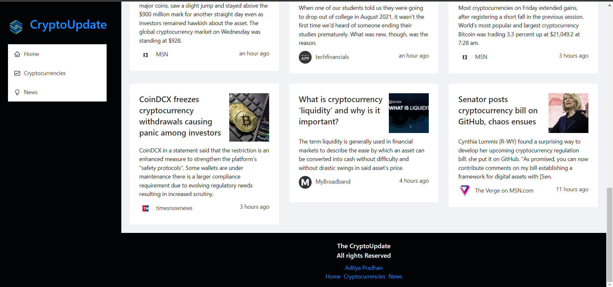

# TheCryptoUpdate
A react application gives updates about Cryptocurrencies. Uses Redux Toolkit for State Management and includes UI Creation using Ant Design, creating charts using Chart.js. Data is fetched from multiple sources using RapidAPI.

## Images - 

